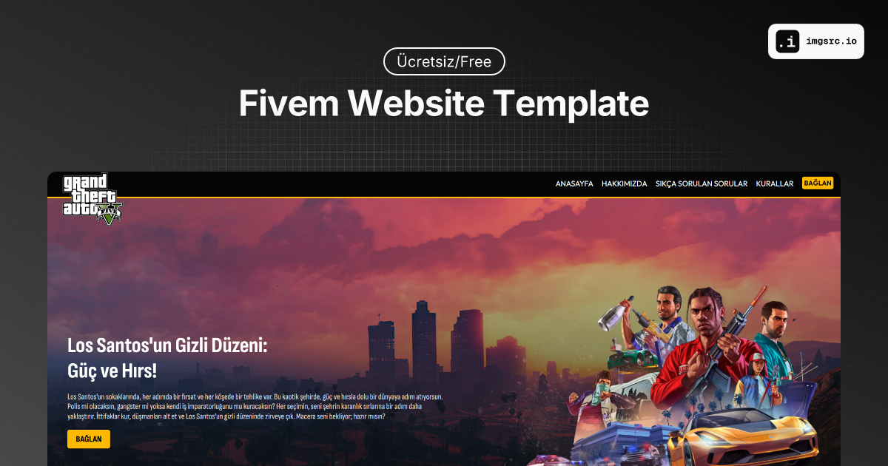

# 🚓 FiveM Roleplay Sunucuları için Ücretsiz Web Sitesi Tasarımı  

Merhaba! 👋  
Bu proje, **FiveM roleplay sunucuları** için hazırladığım tamamen **ücretsiz bir web sitesi tasarımı**dır. Sunucunuzun bilgilerini, kurallarını, ekip üyelerini ve daha fazlasını kolayca sergileyebileceğiniz basit, şık ve kullanışlı bir tasarım sunar.  

## 📷 Önizleme  
  
*Üstteki görsel, tasarımın nasıl göründüğünü genel hatlarıyla gösterir.*  

---

## 🚀 Nasıl Kurulur?  

1. Bu projeyi GitHub'dan indir.  
2. HTML ve CSS dosyalarını düzenleyerek kendi sunucunuza özel bilgileri ekleyin.  
3. Web sitenizi ücretsiz olarak hosting sağlayıcılarına yükleyerek yayına alın.  

### Gereksinimler:  
- Temel HTML/CSS bilgisi.  
- Bir hosting sağlayıcısı (ör. Netlify, Vercel).  

---

## 🛠️ Ücretli Web Sitesi Tasarımı Hizmeti  

Eğer daha özel ve profesyonel bir tasarım istiyorsanız, **özel web sitesi tasarım hizmeti** de sunuyorum.  
- Sunucunuza özel modern tasarımlar  
- Dinamik özellikler ve kullanıcı dostu web paneller  
- Hızlı teslimat ve destek  

💬 Bana ulaşmak için:  
**Discord Kullanıcı Adım:** `@casio.dev`  

---

## 💡 Destek Olmak İster Misiniz?  
Projeyi beğendiyseniz, GitHub üzerinden bir yıldız bırakmayı unutmayın! ⭐  
